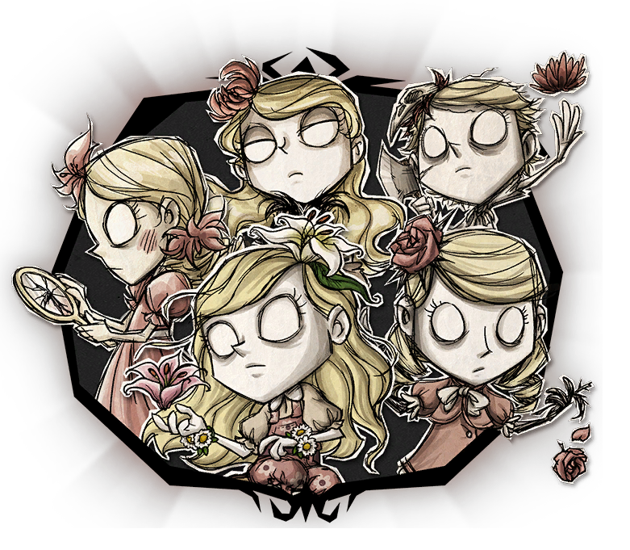

 
  
 

  

<h1>Wendy Panel</h1>

**English** | [简体中文](README.md)

 

## Introduction

Wendy Panel is a distributed panel for managing dedicated server clusters of [Steam Don't Starve Together](https://store.steampowered.com/app/322330/_/). It is based on the modern front-end project [vben](https://github.com/vbenjs/vue-vben-admin) and is implemented by Vue3, Vite5, ant-design-vue, Pinia, Tailwind CSS and Typescript. Wendy Panel can be used to quickly build a Don't Starve server management platform, and it is very convenient to maintain and manage. It is an excellent solution for managing small and medium-sized server clusters, and it is also a management panel that perfectly fits Don't Starve.

## Features

- Containerization: By encapsulating the Don't Starve server into a docker container, server resources can be flexibly controlled

- Distributed: Distributed management of container clusters on multiple machines

- Visualization: Manage server clusters through a rich visual interface

- Internationalization: Supports Chinese/English by default, and other languages ​​can be customized

## Star History

<a href="https://star-history.com/#dstgo/wendy&Date">
 <picture>
   <source media="(prefers-color-scheme: dark)" srcset="https://api.star-history.com/svg?repos=dstgo/wendy&type=Date&theme=dark" />
   <source media="(prefers-color-scheme: light)" srcset="https://api.star-history.com/svg?repos=dstgo/wendy&type=Date" />
   
 </picture>
</a>

## Development

If you also want to participate in the development of the project, I hope you have the following conditions:

- [nodejs](http://nodejs.org/) and [git](https://git-scm.com/) - project development environment
- [Vite](https://vitejs.dev/) - familiar with vite features
- [Vue3](https://v3.vuejs.org/) - familiar with Vue basic syntax
- [TypeScript](https://www.typescriptlang.org/) - familiar with `TypeScript` basic syntax
- [Es6+](http://es6.ruanyifeng.com/) - familiar with es6 basic syntax
- [Vue-Router-Next](https://next.router.vuejs.org/) - familiar with vue-router basic usage
- [Ant-Design-Vue](https://antdv.com/docs/vue/introduce-cn/) - understand AntDV Basic usage
- [Nitro](https://nitro.unjs.io/) - Learn about the basic usage of nitro
- [Vben](https://doc.vvbin.cn/) - Get familiar with the Vben Admin front-end framework

For more information about the project, go to [Document | wendy panel](https://wendy.dstgo.cn) for more information.

## Contribution

If you want to contribute code to this project, please follow the steps below, otherwise it will be ignored.

1. Fork this repository to your account
2. Create a new branch in the forked repository
3. Submit code changes in the new branch
4. Then initiate a Pull Request to this repository
5. Wait for the Pull Request to be merged

For more information, please see [contributing.md](.github/contributing.md) and [commit-convention.md](.github/commit-convention.md).
