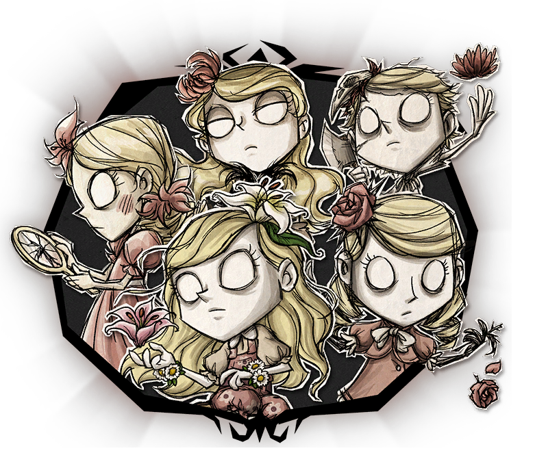

 
  
 

  

<h1>Wendy Panel</h1>

[English](README.en.md) | **简体中文**

 

## 介绍

Wendy Panel是一个分布式管理面板，用于管理[Steam饥荒联机版](https://store.steampowered.com/app/322330/_/) 的专用服务器集群，基于现代化的前端项目[vben](https://github.com/vbenjs/vue-vben-admin) ，它由Vue3、Vite5、ant-design-vue、Pinia、Tailwind CSS和Typescript等技术实现。通过Wendy Panel可以实现快速搭建饥荒服务器管理平台，且非常方便地进行维护和管理，对于管理中小型服务器集群而言是绝佳的解决方案，也是一个完美契合饥荒的管理面板。

## 特性

- 容器化：通过将饥荒服务器封装到docker容器中，可做到弹性控制服务器资源
- 分布式：分布式管理多个机器上的容器集群
- 可视化：通过丰富的可视化界面来管理服务器集群
- 国际化：默认支持中/英双语，也可自定义其它语言

关于项目的更多其它内容，前往[Document | wendy panel](https://wendy.dstgo.cn)了解更多信息。

## Star History

<a href="https://star-history.com/#dstgo/wendy&Date">
 <picture>
   <source media="(prefers-color-scheme: dark)" srcset="https://api.star-history.com/svg?repos=dstgo/wendy&type=Date&theme=dark" />
   <source media="(prefers-color-scheme: light)" srcset="https://api.star-history.com/svg?repos=dstgo/wendy&type=Date" />
   
 </picture>
</a>

## 开发

如果你也想参与到项目的开发中，希望你具备以下几个条件：

- [nodejs](http://nodejs.org/) 和 [git](https://git-scm.com/) -项目开发环境
- [Vite](https://vitejs.dev/) - 熟悉 vite 特性
- [Vue3](https://v3.vuejs.org/) - 熟悉 Vue 基础语法
- [TypeScript](https://www.typescriptlang.org/) - 熟悉`TypeScript`基本语法
- [Es6+](http://es6.ruanyifeng.com/) - 熟悉 es6 基本语法
- [Vue-Router-Next](https://next.router.vuejs.org/) - 熟悉 vue-router 基本使用
- [Ant-Design-Vue](https://antdv.com/docs/vue/introduce-cn/) - 了解 AntDV 基本使用
- [Nitro](https://nitro.unjs.io/) - 了解 nitro 基本使用
- [Vben](https://doc.vvbin.cn/) - 熟悉Vben Admin 前端框架

关于项目的更多其它内容，前往[Document | wendy panel](https://wendy.dstgo.cn)了解更多信息。

## 浏览器支持

本地开发推荐使用Chrome浏览器

|  Edge |  Firefox |  Chrome |  Safari |  iOS Safari |  Samsung |  Opera |
| --- | --- | --- | --- | --- | --- | --- |
| last 2 versions | last 2 versions | last 2 versions | last 2 versions | last 2 versions | last 2 versions | last 2 versions |

## 贡献

如果你想为本项目贡献代码，请参照下面的步骤，否则会被忽略。

1. Fork本仓库到你的账号
2. 在Fork的仓库中创建一个新的分支
3. 在新分支中提交代码修改
4. 然后向本仓库发起Pull Request
5. 等待Pull Request

关于规范请见[contributing.md](.github/contributing.md) 和[commit-convention.md](.github/commit-convention.md)
